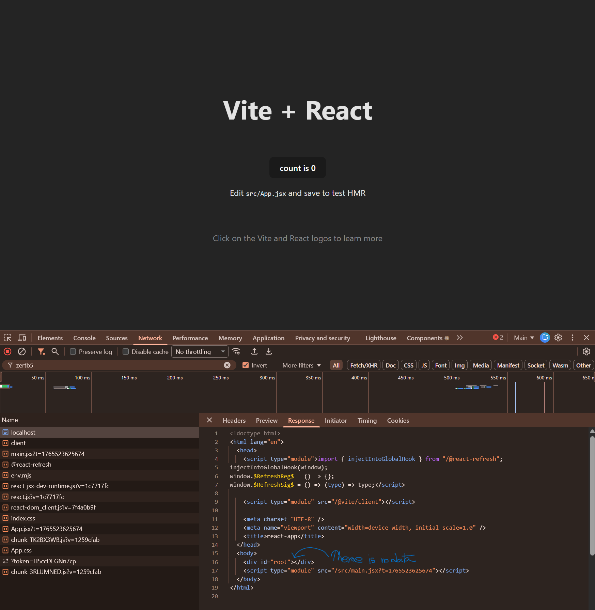
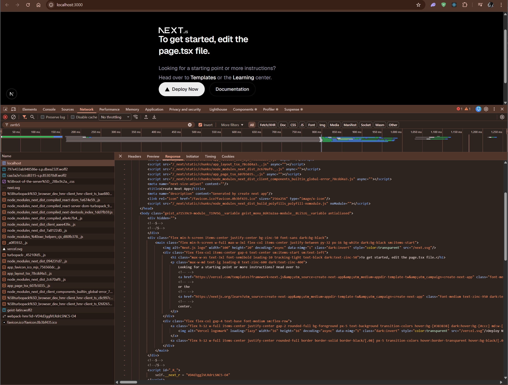
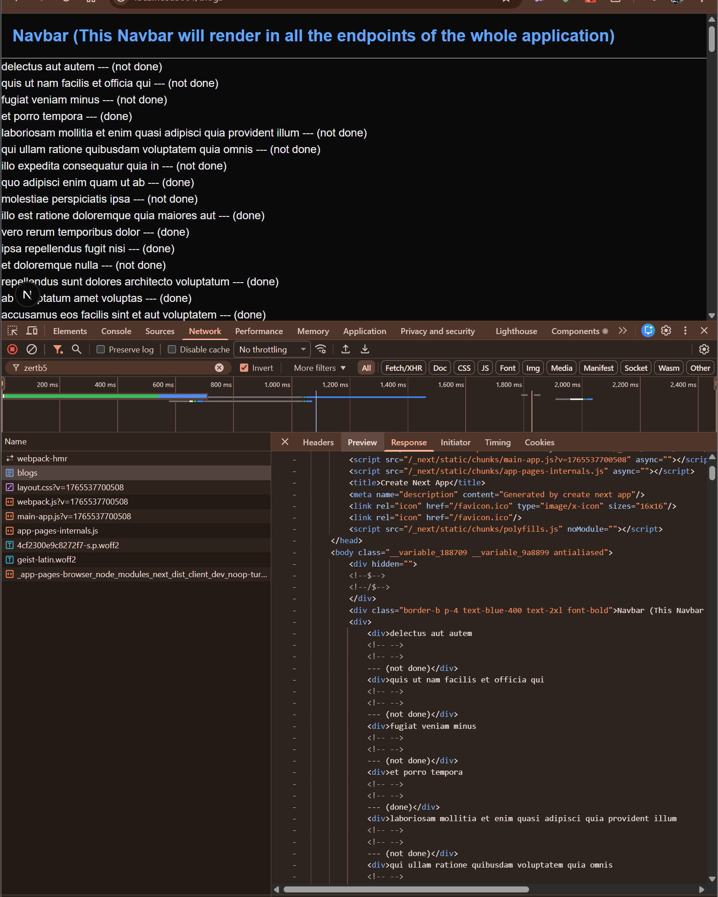

# React App



# Next App




The **two screenshots**:

1. **Vite + React (CSR)**
2. **Next.js (SSR/SSG)**

And you want to understand **why their network → Response tab looks different** and how this visual difference represents **CSR vs SSR/SSG**.

---

# ✅ **1. React (Vite) — CSR (Client-Side Rendering)**

### ✔ What you saw in the screenshot

The **HTML response is empty**:

```html
<body>
  <div id="root"></div>
  <script type="module" src="/src/main.jsx"></script>
</body>
```

❗ **No UI inside HTML. No content. Only `<div id="root"></div>`.**
This means:

### 👉 React sends:

* an EMPTY HTML shell
* then your browser downloads JS
* JS executes
* React builds UI on the client

### 🔥 This is CSR — Client Side Rendering

React **does NOT pre-render the page.**

### 📌 Problems that this causes

| Problem                  | Why it happens                                             |
| ------------------------ | ---------------------------------------------------------- |
| **Waterfall loading**    | Browser must download JS → execute → fetch API → render UI |
| **Slow first paint**     | User sees blank screen until JS loads                      |
| **Bad SEO**              | Google bot sees empty `<body>`                             |
| **Bad for slow mobiles** | Slow JS execution delays UI                                |

So the screenshot clearly shows React = **CSR only**.

---

# ✅ **2. Next.js — SSR (Server Side Rendering)**

### ✔ What you saw in your Next screenshot

You showed this:

```html
<body class="...">
   <main class="...">
      <h1 class="..."> NEXT.js </h1>
      <p>Get started by editing page.tsx.</p>
      <a href="/docs">Documentation</a>
      <button>Deploy Now</button>
   </main>
</body>
```

❗ **ALL THE UI IS ALREADY PRESENT IN THE HTML!**
This means:

### 👉 Next.js server:

* Runs your React components on the server
* Generates complete HTML
* Sends the full page to the browser
* Browser shows UI instantly
* JS loads later for interactivity

### 🔥 This is SSR — Server Side Rendering

---

# ✅ Visual Difference Summary (Based on YOUR screenshots)

### **React (CSR screenshot)**

❌ HTML contains **no real content**
❌ UI loads after React JS downloads
❌ Slow first load
❌ Not SEO friendly

### **Next.js (SSR screenshot)**

✔ HTML contains **FULL page content**
✔ UI appears instantly
✔ SEO friendly
✔ Faster perceived load speed

---

# 📌 WHY THIS DIFFERENCE EXISTS?

Because:

| Framework        | Rendering Method      | What Server Sends        |
| ---------------- | --------------------- | ------------------------ |
| **React (Vite)** | CSR only              | Empty HTML shell + JS    |
| **Next.js**      | SSR + SSG + CSR + ISR | Fully rendered HTML + JS |

React = **Browser is responsible**
Next.js = **Server or CDN is responsible**

---

# 🧠 Easy Real-World Analogy

## 🥤 React = “Make My Food After I Reach”

You go to a restaurant →
Kitchen starts cooking only after you enter →
You wait → Then you get food.

This is CSR.

---

## 🍱 Next.js = “Food Is Ready Before You Arrive”

Restaurant prepares food **before you come** →
You reach → food served immediately →
Only interaction happens later.

This is SSR/SSG.

---

# 📚 Now Let’s Connect This to:

### ✔ CSR

Rendered in browser
React (Vite) = CSR

---

### ✔ SSR

Rendered on server **on every request**
Next.js supports SSR with:

```ts
export const dynamic = "force-dynamic";
```

Or fetch inside Server Component.

---

### ✔ SSG

Pre-rendered once at build time
Next.js supports SSG with:

```ts
export const dynamic = "force-static";
```

OR `fetch({ cache: 'force-cache' })`

---

### ✔ ISR

Static + regeneration
Next.js supports ISR with:

```ts
export const revalidate = 10;
```

---

# 💡 A small real-world example for each

## **Wikipedia**

* Articles do not change often
* SSG (static pages)

## **Stock prices**

* Changes every second
* SSR / ISR

## **Personal dashboard**

* Data changes for each user
* CSR or SSR

## **E-commerce product pages**

* Products change occasionally
* ISR (revalidate every 10 minutes)

---

# ✔ SO — Your Understanding Is Correct

> “Next.js app uses both SSR and SSG based on specific needs
> When data changes continuously → use SSR
> When data is fixed (like Wikipedia) → use SSG”

Yes 👍. Next mixes all 4 models automatically.


---
---
---

Another Example:

