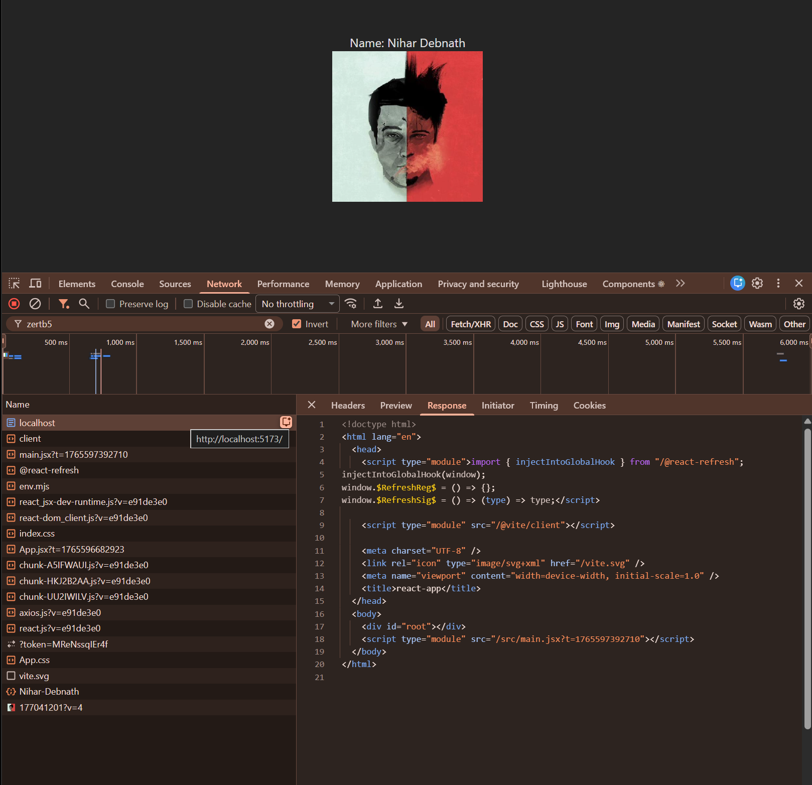

## This screenshot actually shows **very clearly** how the **network waterfall** is happening in your **Vite + React app**, so let’s walk through it **step-by-step exactly in load order**, not theory.

---

## 1️⃣ The FIRST request: `http://localhost:5173/`

### What you see

In Network → **Doc**:

```html
<!doctype html>
<html lang="en">
<head>
  <script type="module">
    import { injectIntoGlobalHook } from "/@react-refresh";
    ...
  </script>

  <script type="module" src="/@vite/client"></script>
  <title>react</title>
</head>

<body>
  <div id="root"></div>
  <script type="module" src="/src/main.jsx"></script>
</body>
</html>
```

### What actually happened

* Browser requested `/`
* **Server returned an EMPTY HTML shell**
* No UI
* No image
* No text like *“Name: Nihar Debnath”*

👉 At this moment:

> **Google / browser sees nothing meaningful**

This is **pure Client-Side Rendering (CSR)**.

---

## 2️⃣ React Refresh + Vite client (DEV only)

### These files load next:

```
/@react-refresh
/@vite/client
```

### Purpose

* Hot Module Reloading (HMR)
* Dev-only
* **Not part of production**

⛔ These add **JS weight**, but **no UI**

---

## 3️⃣ Entry point loads: `main.jsx`

```html
<script type="module" src="/src/main.jsx"></script>
```

This is the **real starting point of your app**.

### What happens inside `main.jsx`

```js
import React from "react";
import ReactDOM from "react-dom/client";
import App from "./App";

ReactDOM.createRoot(document.getElementById("root")).render(
  <App />
);
```

📌 Still:

* No HTML was sent from server
* React **must execute JS first**

---

## 4️⃣ App.jsx loads → UI logic starts

Now Vite loads:

```
App.jsx
App.css
```

Only **after this** React:

* Creates virtual DOM
* Resolves JSX
* Injects HTML into `<div id="root"></div>`

👉 **This is when your image + name appear**

---

## 5️⃣ Image request happens LAST

You see this in Network:

```
177041201?v=4
Nihar-Debnath
```

### Why image loads late

Because:

* Image URL exists **inside JSX**
* JSX is not evaluated until JS runs
* Browser does NOT know image exists beforehand

So:

```txt
HTML → JS → React → JSX → DOM → IMAGE REQUEST
```

📉 This is **bad for SEO & initial load**

---

## 6️⃣ Waterfall summary (REAL ORDER)

Here’s the **exact waterfall** happening:

```
1. GET /                     → empty HTML
2. GET /@react-refresh       → dev helper
3. GET /@vite/client         → dev helper
4. GET /src/main.jsx         → entry JS
5. GET /App.jsx              → component
6. GET /App.css              → styles
7. React renders DOM
8. GET image.jpg             → finally loads
```

⏱️ UI appears **only after step 7**

---

## 7️⃣ Why Google SEO is weak here

Because Google initially sees:

```html
<body>
  <div id="root"></div>
</body>
```

Everything else depends on:

* JS execution
* Network
* Hydration

This is why:

> **Pure React (Vite/CRA) is SEO-weak**

---

## 8️⃣ How Next.js changes the waterfall (IMPORTANT)

### With Next.js (SSR / SSG)

Server sends:

```html
<h1>Name: Nihar Debnath</h1>

```

So waterfall becomes:

```
1. GET / → FULL HTML (content visible)
2. GET image
3. JS hydrates later
```

🔥 Faster
🔥 SEO friendly
🔥 Better LCP

---

## 9️⃣ Final mental model (lock this)

### Your app right now:

* ❌ Client-Side Rendered
* ❌ JS-dependent
* ❌ SEO-poor
* ❌ Slower first paint

### Why dashboards are fine like this:

* Login required
* User-specific
* Google doesn’t index them

### Why landing pages should NOT be like this:

* Content invisible to crawlers initially

---

## 10️⃣ One-line conclusion

> **Your waterfall proves this is a CSR React app where HTML is empty and everything depends on JS execution — which is why companies use Next.js for public pages.**

---
---
---
---


