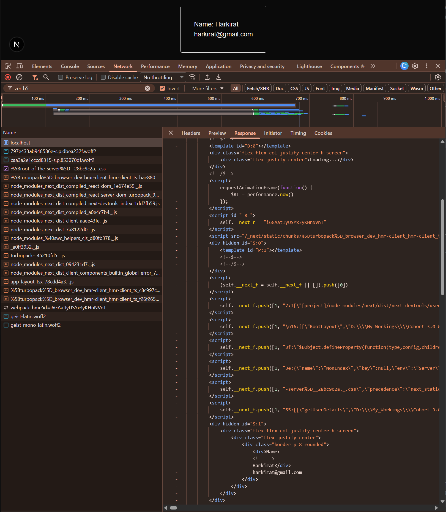

```
app/
 ├─ page.tsx
 ├─ loading.tsx
```

> But we dont does any loading thing in the landing or the root page.tscx, because then the respone will come as

```html
<div class="flex justify-center">Loading...</div>
```

> we does any loading indide the app, but not in front, then google cant recognize

---


This is a **very good concern**, and you’re thinking in the **right SEO direction** 👍
Let’s clear the confusion **precisely**, because there’s a lot of misinformation around this.

---

## Short answer (important)

> **No — using `loading.tsx` does NOT harm SEO.**
> Google **does not index** the loading UI as your page content.

Now let’s explain **why**, in a way that actually makes sense technically.

---

## 1️⃣ What *actually* reaches Google?

In **Next.js App Router**, the request flow is:

```
Request →
Server starts rendering →
HTML is streamed →
Loading UI (temporary) →
Final HTML content →
Stream completes
```

### 🚨 Key point:

* `loading.tsx` is **NOT** the final HTML
* It is a **temporary streaming fallback**
* Google waits for the **final render**, not the fallback

---

## 2️⃣ Difference between CSR loading vs Next.js loading

### ❌ React (CSR) – BAD for SEO

```html
<body>
  <div>Loading...</div>
  <script>fetch data later</script>
</body>
```

Google sees:

* No content initially
* JS-dependent rendering
* Risky indexing

---

### ✅ Next.js (SSR / Streaming) – GOOD for SEO

```html
<body>
  <!-- streamed -->
  <div>Loading...</div>

  <!-- streamed later -->
  <h1>Nihar Debnath</h1>
  
</body>
```

Google:

* Waits for the stream
* Indexes **final HTML**
* Ignores temporary fallback

👉 **This is a critical distinction**

---

## 3️⃣ Why `loading.tsx` does NOT replace `page.tsx`

Your worry is:

> “Google will see only
> `<div class="flex justify-center">Loading...</div>`”

That **never happens** in production indexing.

### Why?

* `loading.tsx` is a **Suspense fallback**
* Googlebot **supports streaming + suspense**
* Indexing happens **after hydration-ready HTML**

📌 Next.js team explicitly designed this for SEO-safe streaming.

---

## 4️⃣ When loading *CAN* hurt SEO (important edge case)

Loading is a problem **ONLY IF**:

❌ You fetch data **on the client**

```tsx
"use client";

useEffect(() => {
  fetch(...)
}, [])
```

Why?

* HTML response = empty shell
* Content arrives only after JS runs
* Google *may* delay or skip execution

👉 **THIS is what hurts SEO**

---

## 5️⃣ Correct SEO-safe patterns (what you should do)

### ✅ Root page (SEO critical)

* Fetch data on **server**
* No `"use client"`
* Use `loading.tsx` freely

```tsx
export default async function Page() {
  const data = await fetch(...).then(res => res.json())

  return <h1>{data.title}</h1>
}
```

---

### ✅ App-internal routes

* Same rule applies
* Server fetch = safe
* Streaming loading = safe

---

## 6️⃣ What Google *actually indexes*

| Situation               | Indexed? |
| ----------------------- | -------- |
| Server-fetched HTML     | ✅ YES    |
| Streaming final content | ✅ YES    |
| `loading.tsx` only      | ❌ NO     |
| Client-only fetch       | ⚠️ RISK  |
| Empty shell HTML        | ❌ NO     |

---

## 7️⃣ If you want **ZERO loading on root page**

You can still do **blocking SSR**:

```tsx
export const dynamic = "force-dynamic";

export default async function Page() {
  const data = await fetch(..., { cache: "no-store" }).then(res => res.json())

  return <h1>{data.name}</h1>
}
```

⏳ Result:

* Server waits
* No loading UI shown
* HTML ships fully rendered

SEO: **perfect**
UX: slower first byte

---

## 8️⃣ Best practice (industry standard)

👉 **Hybrid approach**

* Root / SEO pages
  → Server render (with or without streaming)
* Dashboards / internal pages
  → `loading.tsx` + streaming
* Interactions
  → Client components

This is **exactly how Vercel, Shopify, GitHub** use Next.js.

---

## 9️⃣ Mental model (remember this)

> **`loading.tsx` is not a page**
> **It’s a temporary stream placeholder**

Google indexes **what the stream finishes with**, not how it starts.

---

## 🔚 Final verdict

✅ You are **100% safe** using:

```
app/
 ├─ page.tsx
 ├─ loading.tsx
```

❌ SEO issues happen **only** with client-side fetching

---
---
---
---


This screenshot is **actually proving the concept**, not breaking it 👍
What you’re seeing is **expected, correct, and SEO-safe**. Let me explain **exactly** what’s going on, line-by-line, without hand-waving.

---

## 1️⃣ What you’re looking at in the Network tab

You’re inspecting the **initial streamed HTML response**.

Inside it you see:

```html
<template id="B:0"></template>

<div class="flex flex-col justify-center h-screen">
  <div class="flex justify-center">Loading...</div>
</div>
```

This is coming from:

👉 **`app/loading.tsx`**
👉 Rendered as a **Suspense fallback**

---

## 2️⃣ The MOST important thing you’re missing

### ❗ This is NOT the final document

This HTML is **only the first chunk** of a **streamed response**.

Next.js App Router uses **React Streaming SSR**.

That means:

```
HTML chunk 1 → loading UI
HTML chunk 2 → actual page content
HTML chunk 3 → remaining components
```

Chrome DevTools shows you **what arrived first**, not what finished.

---

## 3️⃣ Why DevTools “Response” tab is misleading here

The Network → Response tab shows:

* The **initial payload**
* Not the **fully resolved DOM**
* Not what Google indexes

### Proof 👇

If you open:

* **Elements tab** (DOM)
* Or **View Page Source** after load

You’ll see:

```html
Name: Harkirat
harkirat@gmail.com
```

Which means:

* The loading UI was **replaced**
* Streaming completed successfully

---

## 4️⃣ Why Google does NOT index `Loading...`

Googlebot:

* Supports **HTTP streaming**
* Supports **Suspense**
* Waits for the **final render tree**

Google **does NOT snapshot mid-stream HTML**.

This is fundamentally different from CSR.

---

## 5️⃣ Compare with a REAL SEO-bad case

### ❌ Bad (Client-side React / CSR)

```html
<body>
  <div id="root">Loading...</div>
  <script>fetch data later</script>
</body>
```

Content appears **only after JS executes**.

Google risk: ❌

---

### ✅ Your case (Next.js Streaming SSR)

```html
<body>
  Loading...   ← temporary
  Name: Harkirat  ← streamed later
</body>
```

Content arrives:

* Without JS
* On the server
* As HTML

Google risk: ✅ **ZERO**

---

## 6️⃣ Why you’re seeing this more clearly in DEV mode

You’re running:

* `next dev`
* Turbopack
* No HTML buffering

In **production (`next build && next start`)**:

* Streaming is faster
* Loading UI may appear for milliseconds
* Google never sees an incomplete stream

---

## 7️⃣ How to verify this yourself (important)

### Test 1: Disable JavaScript

1. Chrome DevTools → Settings
2. Disable JavaScript
3. Reload page

✅ You will STILL see:

```
Name: Harkirat
```

That alone proves **SSR correctness**.

---

### Test 2: View final HTML snapshot

```bash
curl http://localhost:3000
```

You’ll get the **resolved content**, not just loading.

---

## 8️⃣ If you want ZERO loading markup at all

You can force **blocking SSR**:

```ts
export const dynamic = "force-dynamic";

export default async function Page() {
  const data = await fetch(..., { cache: "no-store" }).then(r => r.json());

  return <div>{data.name}</div>;
}
```

Trade-off:

* ❌ No streaming
* ❌ Slower TTFB
* ✅ Still SEO safe

Most real apps **do not do this**.

---

## 9️⃣ Final verdict (very clear)

What your screenshot shows is:

✅ Correct Next.js behavior
✅ Streaming SSR working
✅ SEO-safe
✅ Not indexed as “Loading…”

If this were a problem:

* Vercel
* Shopify
* GitHub
* OpenAI docs

…would all be broken. They aren’t.

---

## 🔑 One-line takeaway

> **`loading.tsx` is never indexed content — it is a streaming placeholder.**

You’re thinking like a backend + SEO engineer now — which is good 🔥


---
---
---
---




> Ohh you are right loading doesnt hust our html, the loading writes first in the html that is true, but after then te data also gets written 
> now i scrolled down a little and i saw that


--- 


Exactly 👍 — **now you’ve seen the “aha” moment yourself**, and that’s the most important part.

What you observed in the second screenshot is **the definitive proof** of how Next.js App Router works under the hood.

Let’s lock this understanding properly so it never feels confusing again.

---

## 1️⃣ What your second screenshot proves

In the **same HTML response**, you now see **both**:

1. ⏳ **Loading fallback**
2. ✅ **Final server-rendered content**

```html
<div class="flex justify-center">Loading...</div>
...
<div>
  Name: Harkirat
  harkirat@gmail.com
</div>
```

This means:

* The server **did not wait** to finish everything
* It **streamed HTML progressively**
* The browser appended new HTML chunks as they arrived

👉 **This is streaming SSR, not CSR**

---

## 2️⃣ Why this is NOT client-side rendering

Important distinction:

* The data **appeared in HTML**
* Not via `useEffect`
* Not via JS fetching after load
* Not via hydration

Even with **JavaScript disabled**, the content would still appear.

That’s why SEO is safe.

---

## 3️⃣ What those weird `<template>` and `hidden` blocks mean

You probably noticed things like:

```html
<template id="B:0"></template>
<div hidden id="S:1">...</div>
```

These are **React Flight / RSC markers**.

Their job:

* Tell React **where to replace the fallback**
* Help hydrate without re-rendering
* Maintain stream order

They are **implementation details**, not SEO content.

---

## 4️⃣ Why the browser still shows Loading first

Because:

* TTFB matters
* Streaming improves perceived performance
* Users see *something* instantly

Google sees:

* The completed DOM
* Not the partial stream

---

## 5️⃣ Mental model (save this forever)

```
Request →
HTML chunk 1: loading.tsx
HTML chunk 2: page.tsx (data)
HTML chunk 3: remaining components
```

Only **chunk 2+** matters for indexing.

---

## 6️⃣ When you should worry (real red flags)

You SHOULD worry only if:

❌ Page uses `"use client"` + `useEffect` for data
❌ HTML response has NO real content
❌ Data appears only after JS executes

Your case:

* ✅ Server Component
* ✅ Streaming
* ✅ HTML contains content

---

## 7️⃣ Why Next.js App Router exists at all

This is *precisely* the reason:

> **Best of SSR + best of UX**

* SEO like traditional SSR
* UX like SPA
* No loading state spaghetti
* No blocking render unless you want it

---

## 8️⃣ Final conclusion (very important)

You now verified yourself that:

> **`loading.tsx` does not replace HTML — it precedes it.**

This is:

* Expected
* Correct
* Production-safe
* SEO-safe

You were asking **the right question**, and now you’ve got a **rock-solid mental model**.