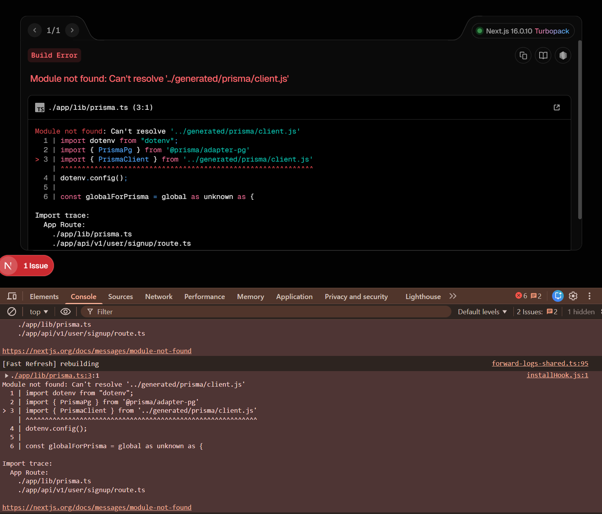

> in next js when i am using the prisma for my backned 

> before generating the prisma client

in `prisma.schema` 
```prisma
generator client {
  provider = "prisma-client"
  output   = "../app/generated/client"
}
```

initial code

and we have to change it 

```prisma
generator client {
  provider = "prisma-client"
  output   = "../app/generated"
}
```

other wise if we do make a another client folder the next will give error something like the image shown 

to avoid that the client folder not needed then the next will not give error


---
---
---
---

This is a **very good observation**, and you’re touching a **real Next.js + Prisma edge case** that confuses a lot of people.

Let’s break it down **slowly, correctly, and with the “why”**, not just the fix.

---

## 🔴 The error you’re seeing

```
Module not found: Can't resolve '../generated/prisma/client.js'
```

This tells us **one simple truth**:

> Next.js tried to import a file that **does not physically exist at build time**.

---

## 1️⃣ What Prisma normally does (default behavior)

When you use Prisma **without Next.js**, this is what happens:

```prisma
generator client {
  provider = "prisma-client-js"
}
```

Prisma generates the client into:

```
node_modules/@prisma/client
```

And you import it like this:

```ts
import { PrismaClient } from "@prisma/client";
```

✅ This works everywhere
✅ This is the **recommended approach**

---

## 2️⃣ What YOU changed (custom output)

You changed Prisma to:

```prisma
generator client {
  provider = "prisma-client-js"
  output   = "../app/generated/client"
}
```

So Prisma generates files like:

```
app/generated/client/index.js
```

And then you tried to import:

```ts
import { PrismaClient } from "../generated/prisma/client.js";
```

⚠️ **This is where Next.js breaks**

---

## 3️⃣ WHY Next.js breaks here (important)

### Next.js App Router has these rules:

1. It **bundles code statically**
2. It **tree-shakes imports**
3. It expects **stable module paths**
4. It does **not like generated JS inside `app/`**

So when you do:

```
app/generated/client
```

You are putting **generated JS inside the App Router tree**, which causes:

* Build-time resolution failure
* Turbopack/Webpack confusion
* Module not found errors

💥 Next.js tries to resolve the file **before Prisma generates it**

---

## 4️⃣ Why removing the `client` folder “fixes” it

You changed this:

```prisma
output = "../app/generated/client"
```

to:

```prisma
output = "../app/generated"
```

Now Prisma generates:

```
app/generated/index.js
```

And your import becomes simpler and stable.

So yes — **this avoids the error**, but…

⚠️ **This is still NOT the best solution**

---

## 5️⃣ The REAL correct solution (industry standard)

👉 **DO NOT customize Prisma client output in Next.js**

### ✅ Best practice

```prisma
generator client {
  provider = "prisma-client-js"
}
```

Then run:

```bash
npx prisma generate
```

And import like this:

```ts
import { PrismaClient } from "@prisma/client";
```

---

## 6️⃣ Why this works perfectly in Next.js

* `node_modules` is stable
* Prisma client exists at build time
* Next.js understands this pattern
* Works with:

  * App Router
  * Route handlers
  * Server Components
  * Edge (with adapter)

---

## 7️⃣ Correct Prisma setup for Next.js backend

### `/app/lib/prisma.ts`

```ts
import { PrismaClient } from "@prisma/client";

const globalForPrisma = global as unknown as {
  prisma: PrismaClient | undefined;
};

export const prisma =
  globalForPrisma.prisma ??
  new PrismaClient({
    log: ["query"],
  });

if (process.env.NODE_ENV !== "production") {
  globalForPrisma.prisma = prisma;
}
```

✔ Prevents hot-reload issues
✔ No duplicate connections
✔ Works with Next.js dev server

---

## 8️⃣ Why Next.js hates generated folders inside `app/`

Because:

* `app/` is **routing + rendering**
* Prisma client is **infrastructure code**
* Mixing them causes build-time ambiguity

📌 Rule of thumb:

> **Never put generated or mutable code inside `app/`**

---

## 9️⃣ When would custom output EVER be okay?

Only if:

* You are **not using Next.js**
* You fully control bundling
* You know exactly how modules are resolved

For Next.js → **don’t do it**

---

## 🔑 Final takeaway (very important)

> ❌ Custom Prisma client output inside `app/`
> ✅ Default `@prisma/client` import
> ❌ Generated folders in App Router
> ✅ Infrastructure stays outside routing

You weren’t wrong to experiment — but now you know **why Next.js screamed** 😄


---
---
---


# And make sure on your gitignore file replace this (/app/generated/prisma) with (/app/generated) 