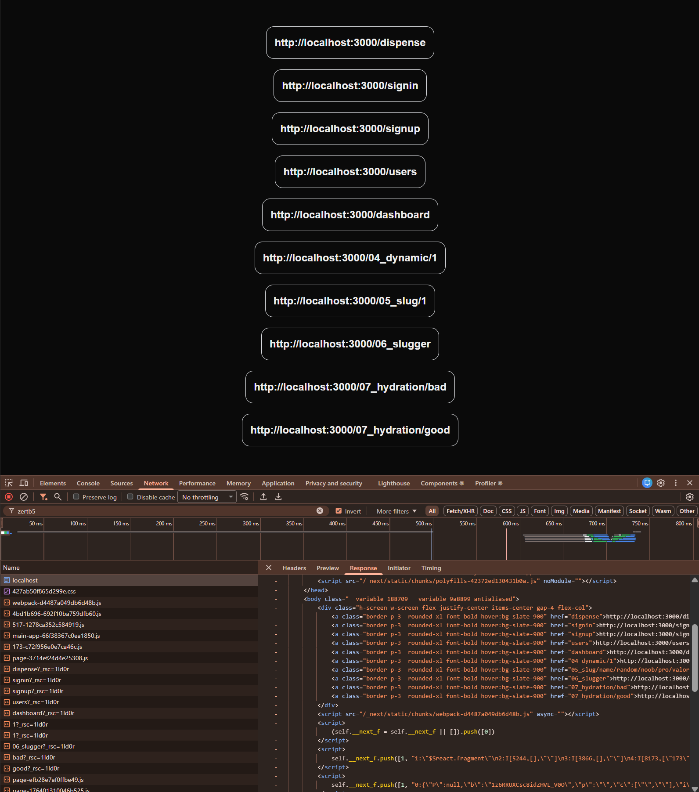
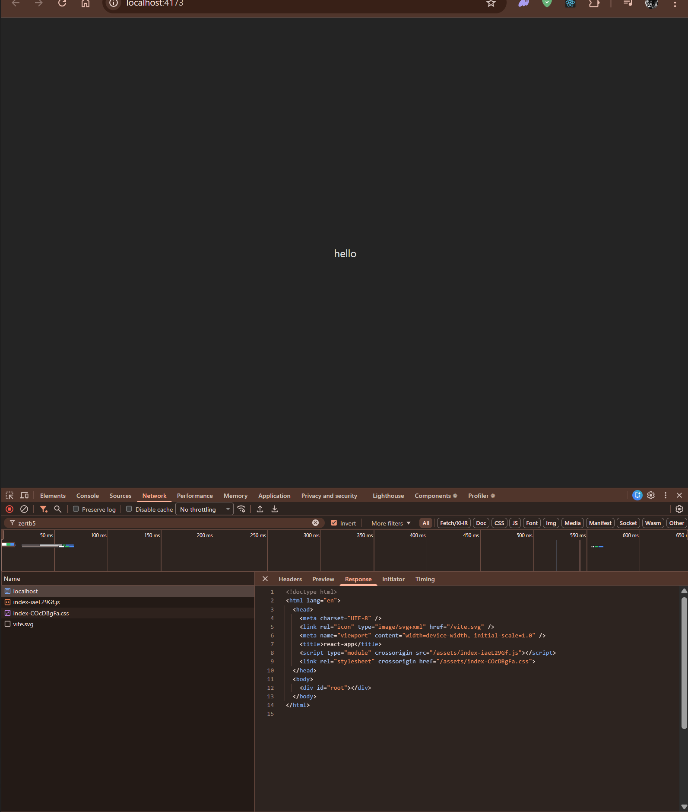

# Explain these differences between a next app build and react app build

> `next-app`

```sh
> cd next-app
> npm run build  

> my_app@0.1.0 build
> next build

   ▲ Next.js 15.1.2

   Creating an optimized production build ...
 ✓ Compiled successfully
 ✓ Linting and checking validity of types    
 ✓ Collecting page data    
 ✓ Generating static pages (13/13)
 ✓ Collecting build traces    
 ✓ Finalizing page optimization

Route (app)                              Size     First Load JS
┌ ○ /                                    178 B           109 kB
├ ○ /_not-found                          979 B           106 kB
├ ƒ /04_dynamic/[postId]                 161 B           106 kB
├ ƒ /05_slug/[...todoId]                 178 B           109 kB
├ ƒ /06_slugger/[[...slugger]]           161 B           106 kB
├ ○ /07_hydration/bad                    352 B           106 kB
├ ○ /07_hydration/good                   305 B           106 kB
├ ○ /dashboard                           178 B           109 kB
├ ○ /dashboard/settings                  161 B           106 kB
├ ○ /dashboard/users                     161 B           106 kB
├ ○ /dispense                            161 B           106 kB
├ ○ /signin                              161 B           106 kB
├ ○ /signup                              161 B           106 kB
└ ○ /users                               161 B           106 kB
+ First Load JS shared by all            105 kB
  ├ chunks/4bd1b696-692f10ba759dfb60.js  52.9 kB
  ├ chunks/517-1278ca352c584919.js       50.5 kB
  └ other shared chunks (total)          1.95 kB


○  (Static)   prerendered as static content
ƒ  (Dynamic)  server-rendered on demand
```

> `react-app`

```sh
> cd react-app
> npm run build

> react-app@0.0.0 build
> vite build

vite v7.2.7 building client environment for production...
✓ 29 modules transformed.
dist/index.html                   0.46 kB │ gzip:  0.29 kB
dist/assets/index-COcDBgFa.css    1.38 kB │ gzip:  0.70 kB
dist/assets/index-iaeL29Gf.js   193.31 kB │ gzip: 60.63 kB
✓ built in 1.08s
```

---



---





---
---
---


# Big picture first (1-line summary)

> **React (Vite) builds a single JavaScript application.
> Next.js builds a web server + pre-rendered pages + JavaScript only where needed.**

Everything you’re seeing flows from this.

---

## 1️⃣ What a React (Vite) build actually produces

### Your React build output

```txt
dist/index.html
dist/assets/index-COcDBgFa.css
dist/assets/index-iaeL29Gf.js   (~193 kB)
```

### What this means

React (Vite) builds **one SPA bundle**:

* `index.html` → almost empty
* One big JS file → contains **entire app**
* CSS file → styles

If you open `index.html` (like in your screenshot):

```html
<body>
  <div id="root"></div>
  <script src="/assets/index-iaeL29Gf.js"></script>
</body>
```

👉 **No UI exists yet**

### What happens in the browser

1. Browser loads HTML (empty)
2. Downloads JS (~193 kB)
3. React runs
4. React creates DOM
5. You finally see `"hello"`

This is why in Network tab you saw:

* `index.html` (empty)
* JS file
* React mounts later

This is called:

> **Client-Side Rendering (CSR)**

---

## 2️⃣ What a Next.js build actually produces

Now compare this with Next.js:

```txt
✓ Collecting page data
✓ Generating static pages (13/13)
✓ Collecting build traces
✓ Finalizing page optimization
```

This is **not** just bundling JS.

Next.js is doing **three jobs**:

1. Building React components
2. Executing them on the **server**
3. Deciding **how each route should be delivered**

---

## 3️⃣ Why Next.js shows a ROUTE TABLE (React doesn’t)

This table:

```txt
Route (app)                Size     First Load JS
○ /                        178 B    109 kB
ƒ /04_dynamic/[postId]     161 B    106 kB
```

exists because:

> **Next.js treats every route as a separate entry point**

React does **not have routes at build time**.
React Router runs **only in the browser**.

So:

* React → *one app*
* Next.js → *many pages*

---

## 4️⃣ Meaning of ○ Static vs ƒ Dynamic

### ○ Static (pre-rendered)

```txt
○ /signin
○ /dashboard
```

At build time:

* Next.js runs your component
* Generates **HTML**
* Saves it to disk

When you request `/signin`:

* Server returns HTML immediately
* Browser already has UI

This is why HTML response in your Next.js Network tab contains:

```html
<a href="/signin">...</a>
```

👉 UI is already there **before JS runs**

---

### ƒ Dynamic (server-rendered on demand)

```txt
ƒ /04_dynamic/[postId]
ƒ /06_slugger/[[...slugger]]
```

These depend on:

* Params
* Request data
* Dynamic logic

So Next.js:

* Keeps them as **server functions**
* Runs them **per request**

Still: HTML is returned, not empty.

---

## 5️⃣ Why Next.js HTML is “big” but React HTML is “empty”

### React HTML (from your screenshot)

```html
<div id="root"></div>
```

React sends **instructions**, not UI.

---

### Next.js HTML (from your screenshot)

```html
<div class="flex gap-4">
  <a href="/signin">...</a>
  <a href="/signup">...</a>
</div>
```

Next.js sends **actual UI**.

This is the **single biggest architectural difference**.

---

## 6️⃣ Why First Load JS is smaller *per page* in Next.js

React:

```txt
index-iaeL29Gf.js → 193 kB
```

Every route loads:

* Dashboard
* Users
* Signin
* Everything

---

Next.js:

```txt
First Load JS shared by all → 105 kB
```

Then:

* Page-specific JS loads **only if needed**
* Server Components ship **zero JS**

So:

* `/users` doesn’t download `/signin` logic
* `/dashboard` doesn’t ship slug logic

This is **automatic code-splitting**.

---

## 7️⃣ Why React build has no “Static / Dynamic” concept

React doesn’t know:

* URLs
* Params
* Requests
* Server

So it cannot:

* Pre-render pages
* Decide per route strategy

React = **UI library**
Next.js = **web framework**

---

## 8️⃣ Why Next.js build takes longer

React build:

```txt
✓ built in 1.08s
```

Next.js build:

* Executes components
* Generates HTML
* Builds server bundles
* Traces dependencies
* Splits routes

It’s building **an application server**, not just JS.

---

## 9️⃣ Mental model (most important)

### React (Vite)

```
HTML (empty)
↓
Download JS
↓
JS builds UI
↓
User sees page
```

### Next.js

```
HTML (ready UI)
↓
JS hydrates
↓
User interacts
```

---

## 10️⃣ Why this matters in real life

| Area          | React SPA       | Next.js       |
| ------------- | --------------- | ------------- |
| SEO           | Poor by default | Excellent     |
| First paint   | Slower          | Faster        |
| JS size       | Large           | Smaller       |
| Routing       | Client-only     | Server-aware  |
| Data fetching | After render    | Before render |
| Auth          | Client hacks    | Server-native |

---

### Final takeaway

> React builds **a JavaScript app**
> Next.js builds **a website + server + JS**

That’s why:

* Outputs look different
* Network tab looks different
* Build logs look different
