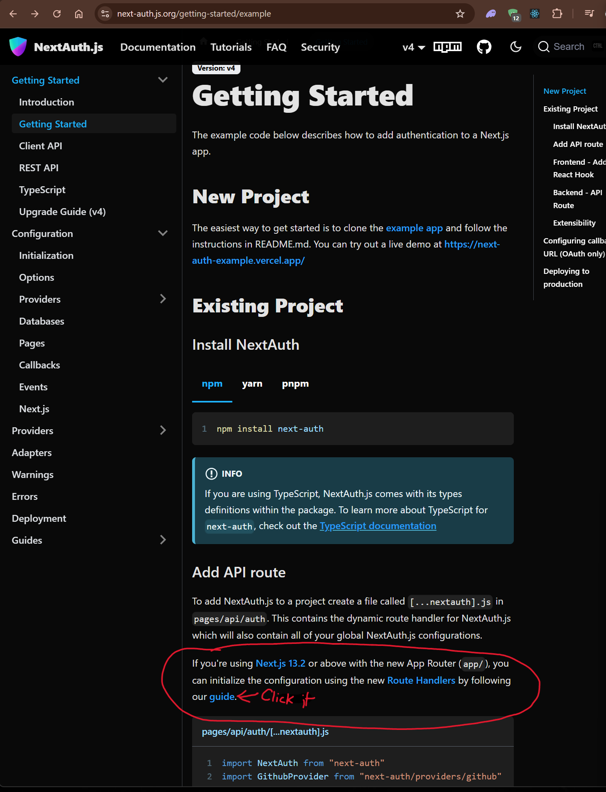
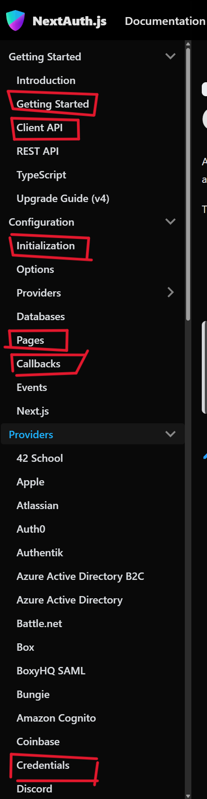

### Todays class slide link:

- 1st slide (middlewate in next and the assigment) because these are left on previous class

```link
https://petal-estimate-4e9.notion.site/NextJS-Part-3-1637dfd107358090800ff3aaed7a5b3c
```

- 2nd slide 

```link
https://projects.100xdevs.com/tracks/Next-Auth/La3EksBcKVqExEMwNAxa
```


---


### Commands

```sh
npx create-next-app@latest
npm i next-auth
```


#### Next-Auth [Official Doc](https://next-auth.js.org/getting-started/example)




> after that follow the steps from here -> [https://next-auth.js.org/configuration/initialization](https://next-auth.js.org/configuration/initialization), 
> because we are using the app router in next app, which is new not the old.


### There are so many provider on next-auth [see here](https://next-auth.js.org/providers/)

- Visit the upper link, because from there we have to take the codes of the providers.

- In among most all the providers the credential providers bit complicated ones


### Once the provider added succesfully, now we need the features for user to do logout, or signin options to users, thats why we need the [client api](https://next-auth.js.org/getting-started/client)


---



- These red boxes is very important while build you next app with next auth